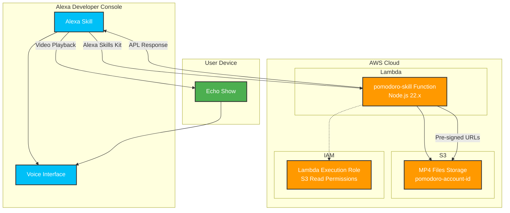

# Pomodoro Skill

Echo Show向けのポモドーロタイマーAlexaスキルをAWS CDKで構築するインフラストラクチャコードです。

## 概要

このプロジェクトは、「アレクサ、ポモドーロ」の呼びかけでポモドーロタイマー動画を再生するAlexaスキルのバックエンドインフラを提供します。

### 主な機能

- **音声起動**: 「アレクサ、ポモドーロ」で即座にタイマー開始
- **動画再生**: S3に保存されたMP4ファイルをEcho Showで再生
- **アスペクト比維持**: APL（Alexa Presentation Language）による適切な動画表示
- **自動ファイル選択**: ファイル名順で動画を自動選択・再生
- **シンプル操作**: 追加操作不要、起動から終了まで自動実行

### 対応デバイス

- Amazon Echo Show (全世代)
- Echo Show 5/8/10/15
- Fire TV (Alexa対応)

## 構成



### インフラストラクチャコンポーネント

| コンポーネント | 説明 | 設定詳細 |
|---|---|---|
| **S3 Bucket** | MP4ファイル保存 | `pomodoro-{account-id}`<br/>暗号化有効、パブリックアクセス無効 |
| **Lambda Function** | Alexaスキルバックエンド | Node.js 22.x、esbuildバンドリング<br/>タイムアウト30秒 |
| **IAM Role** | Lambda実行ロール | S3読み取り権限、CloudWatch Logs |

## 使い方

### 1. 前提条件

- AWS CLI設定済み
- Node.js 18.x以上
- Docker（CDKバンドリング用）
- Amazon Developer Console アカウント

### 2. デプロイ手順

#### インフラのデプロイ

```bash
# 依存関係のインストール
yarn install

# CDKスタックのデプロイ
yarn cdk deploy

# 出力例
# PomodoroSkill.AlexaSkillFunctionArn = arn:aws:lambda:ap-northeast-1:xxxxx:function:pomodoro-skill
# PomodoroSkill.BucketName = pomodoro-xxxxx
```

#### MP4ファイルのアップロード

```bash
# S3バケットに動画ファイルをアップロード
aws s3 cp your-pomodoro-video.mp4 s3://pomodoro-{your-account-id}/

# 複数ファイルの場合（ファイル名順で再生されます）
aws s3 cp pomodoro-25min.mp4 s3://pomodoro-{your-account-id}/
aws s3 cp pomodoro-5min-break.mp4 s3://pomodoro-{your-account-id}/
```

### 3. Alexaスキルの設定

#### Developer Consoleでの設定

1. **新しいスキルを作成**
   - スキル名: `ポモドーロタイマー`
   - デフォルト言語: `日本語 (JP)`
   - スキルタイプ: `カスタム`

2. **呼び出し名の設定**
   ```
   呼び出し名: ポモドーロ
   ```

3. **インターフェースを有効化**
   - `ビルド` → `インターフェース`
   - ✅ **Alexa Presentation Language (APL)**

4. **エンドポイントの設定**
   - `ビルド` → `エンドポイント`
   - **AWS Lambda ARN**: デプロイ時に出力されたLambda ARN
   ```
   arn:aws:lambda:ap-northeast-1:xxxxx:function:pomodoro-skill
   ```

5. **Lambda トリガーの設定**
   ```bash
   # AWS CLIでトリガーを追加
   aws lambda add-permission \
     --function-name pomodoro-skill \
     --statement-id alexa-skill-trigger \
     --action lambda:InvokeFunction \
     --principal alexa-appkit.amazon.com \
     --event-source-token {your-skill-id}
   ```

6. **モデルのビルド**
   - `ビルド` → `インタラクションモデル`
   - 「モデルを保存してビルド」

### 4. テスト

#### Developer Consoleでのテスト

1. `テスト` タブに移動
2. テストを「開発」で有効化
3. デバイスを「Echo Show」に設定
4. 「ポモドーロ」と入力してテスト

#### 実機でのテスト

1. **スキルを開発段階で公開**
   - `配布` → `スキルプレビュー`
   - 「ベータテスト」で自分のアカウントを追加

2. **Echo Showでテスト**
   ```
   「アレクサ、ポモドーロ」
   ```

### 5. トラブルシューティング

#### ログの確認

```bash
# Lambda関数のログを確認
aws logs tail /aws/lambda/pomodoro-skill --follow

# S3バケットの内容を確認
aws s3 ls s3://pomodoro-{your-account-id}/
```

#### よくある問題

| 問題 | 原因 | 解決方法 |
|---|---|---|
| 「スキルが応答できません」 | Lambda関数エラー | CloudWatch Logsでエラー確認 |
| 「動画ファイルが見つかりません」 | S3にMP4ファイルなし | S3にMP4ファイルをアップロード |
| 動画が再生されない | APL無効 | Developer ConsoleでAPL有効化 |

## 開発用コマンド

```bash
# TypeScriptコンパイル
yarn build

# 変更監視モード
yarn watch

# テスト実行
yarn test

# CDK差分確認
yarn cdk diff

# CloudFormationテンプレート生成
yarn cdk synth
```

## ライセンス

MIT License
